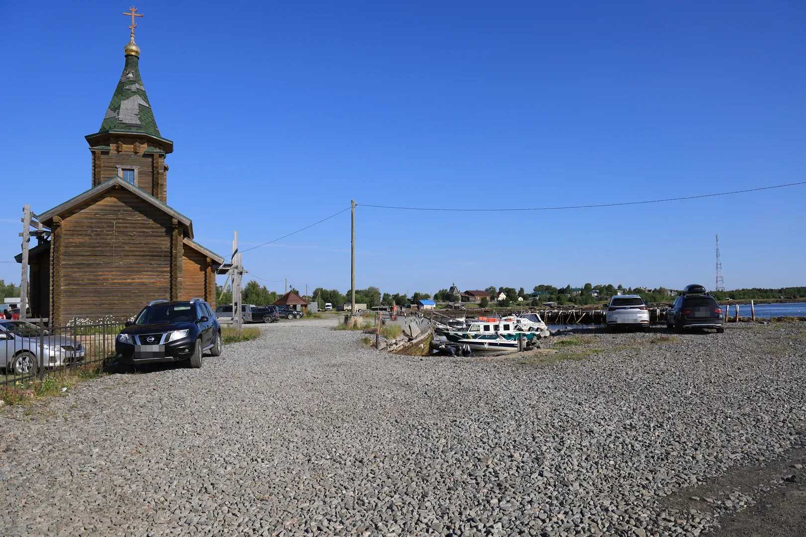
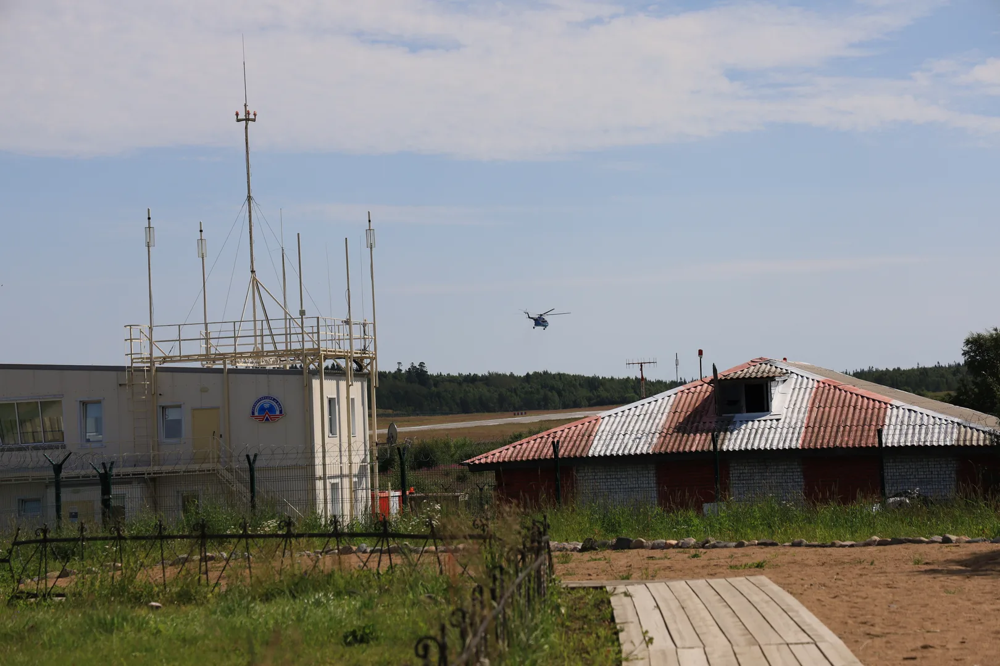
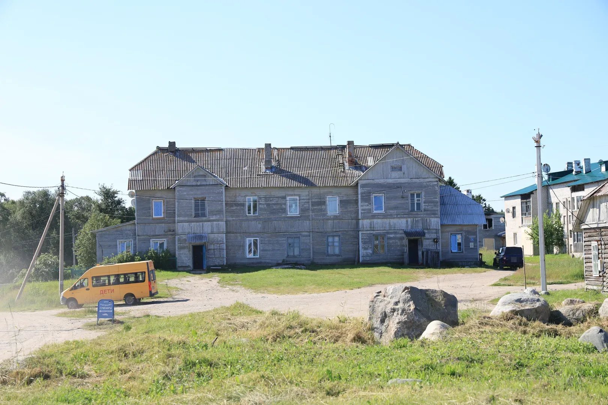
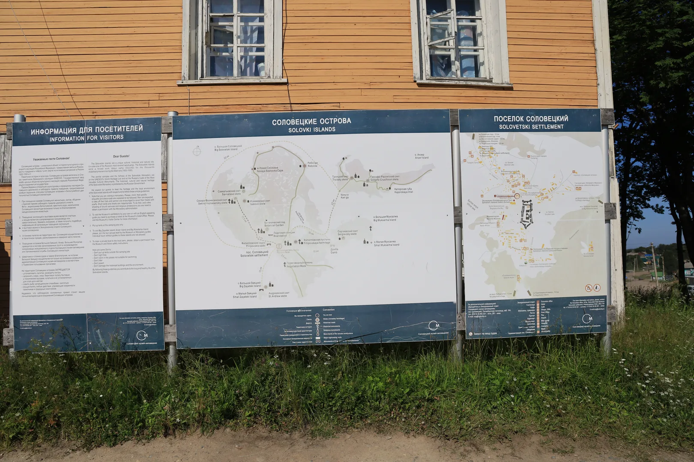

# Solovki Islands (Part IV). How to Get Anywhere

*Published: 2026-08-03*

The final part on traveling on the Solovetsky Islands.

* [Part I](./2026-07-18-solovki-part1.md)
* [Part II](./2026-07-27-solovki-part2.md)
* [Part III](./2026-08-02-solovki-part3.md)

In this part I wanted to discuss some aspects of hiking on the islands.

## Getting to the Islands

As of 2026, there is only one port with transfers to the archipelago — [Rabocheostrovsk (RU)](https://ru.wikipedia.org/wiki/%D0%A0%D0%B0%D0%B1%D0%BE%D1%87%D0%B5%D0%BE%D1%81%D1%82%D1%80%D0%BE%D0%B2%D1%81%D0%BA), near [Kem](https://en.wikipedia.org/wiki/Kem,_Russia).
Kem has always been a busy port for northern fishermen and has its own deep history.

There is an airport on Bolshoy Solovetsky Island (I have a photo of it in [part I](./2026-07-18-solovki-part1.md)), but airplanes rarely come there, and tickets are notoriously hard to come by.
The busiest part of the airport is the helipad, which transfers mail and patients to Arkhangelsk.

## Living on the Island

There are at least two hotels on the island, where most tourist groups stay, as I understood it.
We, like most small groups of hikers, rented apartments from locals.
And the demand is such that the rent alone is enough for the locals to decide to live elsewhere during the high season.

There is also a tent camp for tourists who don't want to rent and are happy to stay in a tent for their trip.

Almost everything is delivered to the island by sea.
Local food consists only of a bakery (a good one), berries, and some milk.
So if you want to make your stay a bit cheaper, you can bring your own food and live off gathering berries and mushrooms.
We gathered so many mushrooms that we brought some back from the archipelago as pickles.

As a side note, there are new cottages at the settlement built specifically for tourists.
But they are so outrageously expensive (think five times the price of an apartment for five people) that I'm not sure who rents them.
And even though they are new, they held so little visual interest for me that I forgot to take a photo of them.

## Getting around

The islands are not so big that you need a vehicle.
But Bolshoy Solovetsky is big enough to justify a bicycle.
There are a lot of bicycles on the island, and you can rent different kinds by the hour or by the day.
But you can reach most parts of the island on foot.

---

> This post is part of my [#100DaysToOffload](https://100daystooffload.com/) challenge.
