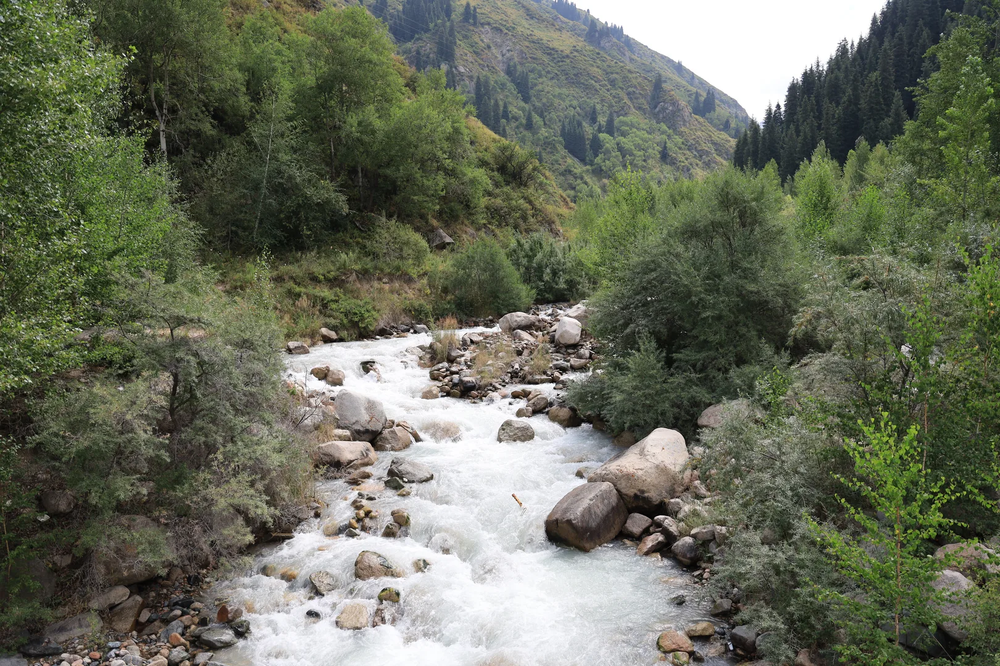
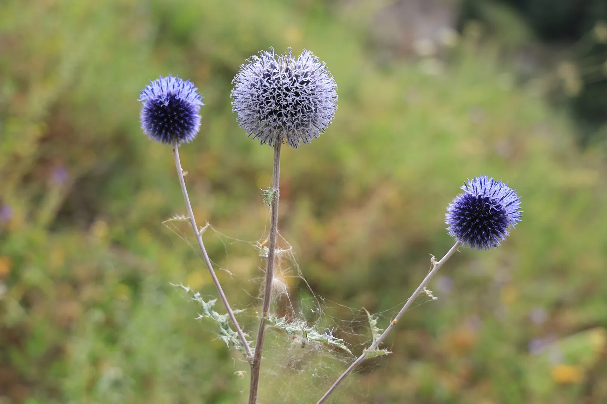
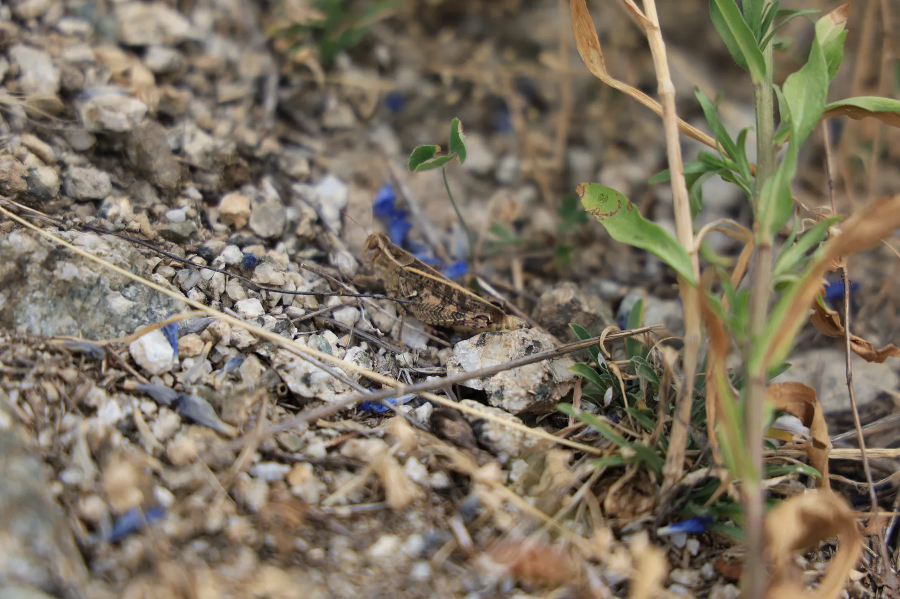
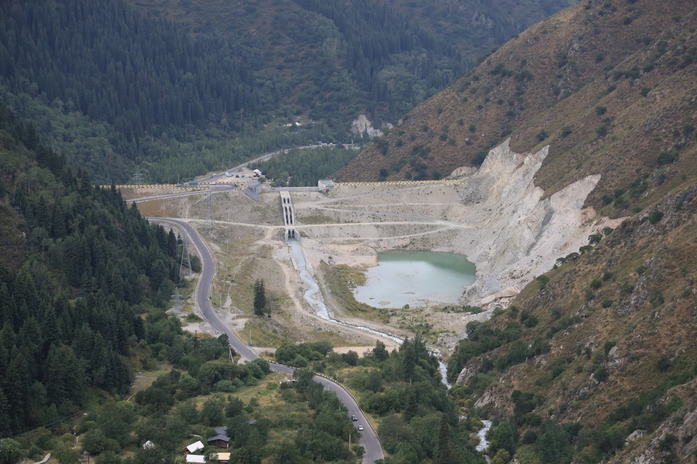
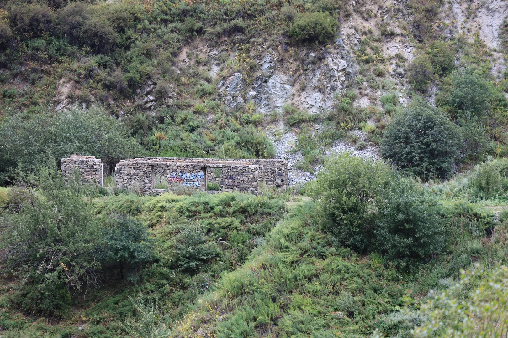
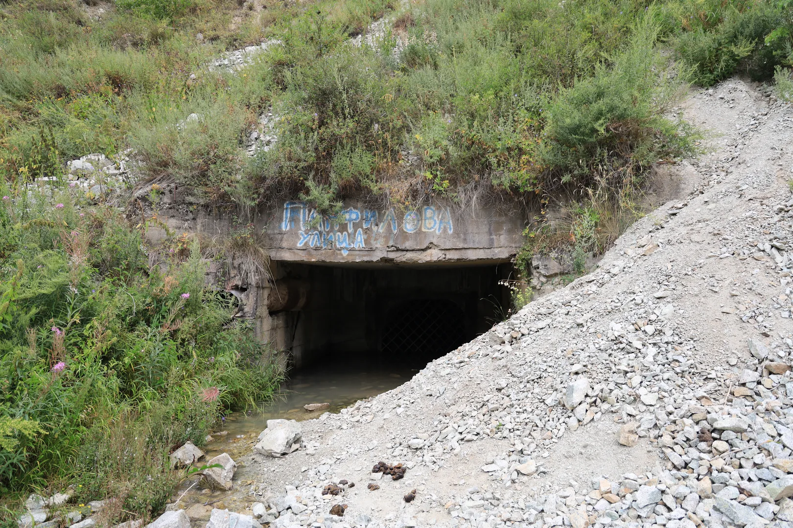
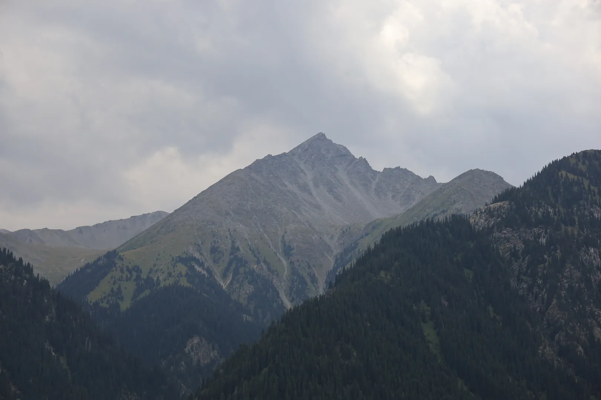
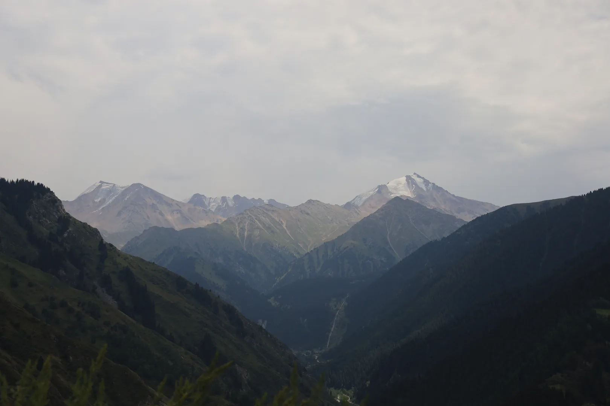
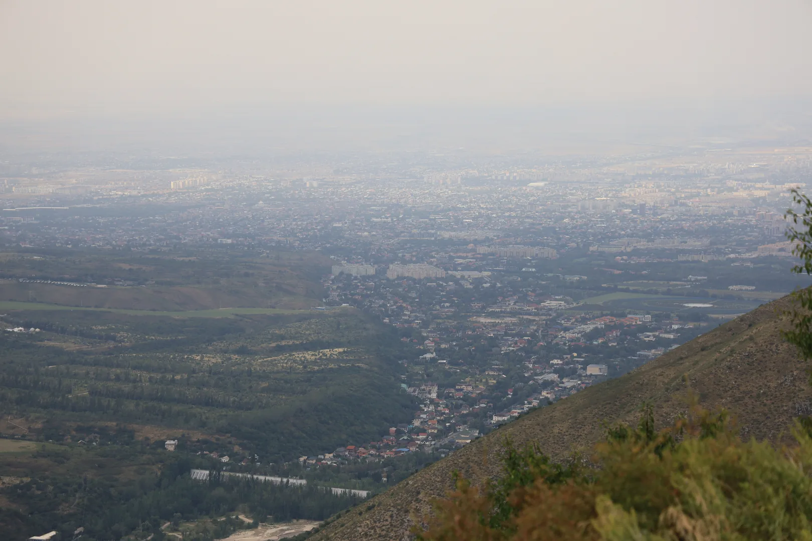
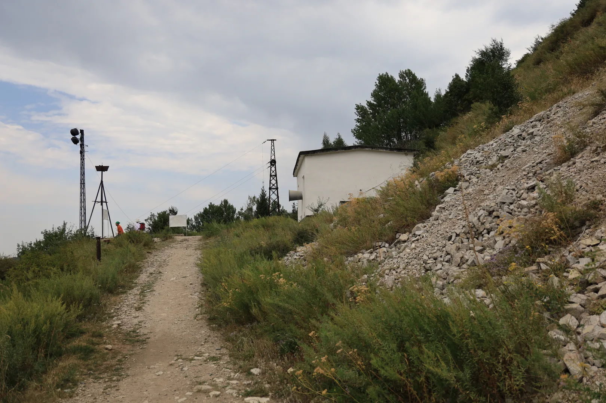

# Where to go in Almaty. Old Japanese Road

*Published: 2026-08-05*

As I live in Almaty and like taking photos of various things, I occasionally hike in the mountains nearby.
So this post is a short description of one of those places --- the Old Japanese Road.
It is a nice hike for anyone who can stay on their feet for several hours.

I went there on the 5th of August, and we had great weather for mountain hiking: not too hot (around 25°C), little Sun, and no rain.
It is also a great way to escape the heat of the city (it was almost 37°C down there, with much more Sun exposure).

There are several ways to start this hike: two from the north --- [43.12608, 76.91121](https://www.openstreetmap.org/search?lat=43.12608&lon=76.91121&zoom=15#map=15/43.12609/76.91121) is the lower one, with a steep slope, and [43.11627, 76.91741](https://www.openstreetmap.org/search?lat=43.11627&lon=76.91741&zoom=16#map=16/43.11628/76.91741) has a long metal staircase running to the top --- and one from the south, [43.094347, 76.954240](https://www.openstreetmap.org/search?lat=43.094347&lon=76.954240&zoom=17#map=17/43.094351/76.954240), which has the smallest elevation gain.
This time I chose to start from the southern one, as it is higher and the overall elevation gain is less noticeable.

If you want to get there, notice that there is no public transport to southern part of this trail.
So you would either rent a car, or call a taxi.
There is also an entrance fee at the checkpoint on the road as this is part of Ile-Alatau park.

The name of this route comes with a legend: that it was built by Japanese prisoners of war,
who were also put to work in mines here.
I have heard it from other hikers and read it in local travel articles,
but never from a historian, and none of the articles I found cite a document.

The road makes more sense once you notice what it follows and what is near nowadays.
It runs along the penstock of the second hydroelectric station --- a welded steel pipe
a little over a kilometre long[^1], dropping down the slope to the turbines.
What I took for mining shafts are, by the better-researched accounts I could find,
inspection adits for that pipe, driven some 70--80 metres into the rock and now standing in water.
The rails are left from the narrow-gauge rig that winched the pipe sections up the slope
while it was being built.
So this is a service road for the waterworks, and it was built to be one.

The chronology is the awkward part for the legend.
There were indeed a lot of Japanese prisoners in Kazakhstan after the war --- around six thousand
in Almaty, working mostly on public buildings in 1946--47, and the last of them were repatriated by 1950.
The second hydroelectric station went up in 1959, nearly a decade later.

Decide for yourself whether you believe the legend.
I find the real story better: a piece of Soviet hydro engineering that picked up a Japanese name because of a good story.

You can see a lot of gorgeous mountain tops on any mountain trail here.
From the Old Japanese Road you can see the range near the Kazakhstan-Kyrgyzstan border, which rises above 4 km.

[^1]: that figure as well as other details of the pipe comes from a [detailed write-up of the road (RU)](https://turgenskiy.livejournal.com/16573.html) by the LiveJournal user *turgenskiy*, and so do the depth of the adits, the narrow-gauge rig that hauled the pipe sections up, and the 1959 date for the station. It is a blog post rather than an archival source, but it is the most carefully researched account of this road I could find.

---

> This post is part of my [#100DaysToOffload](https://100daystooffload.com/) challenge.
