# Where to go in Almaty. Köktöbe

In contrast to the previous posts about hiking in the mountains near Almaty, today I want to show photos from a trip to [Köktöbe](https://en.wikipedia.org/wiki/K%C3%B6k_T%C3%B6be_%28recreation_area%29), a hill inside the city whose television tower is visible from almost anywhere in Almaty.

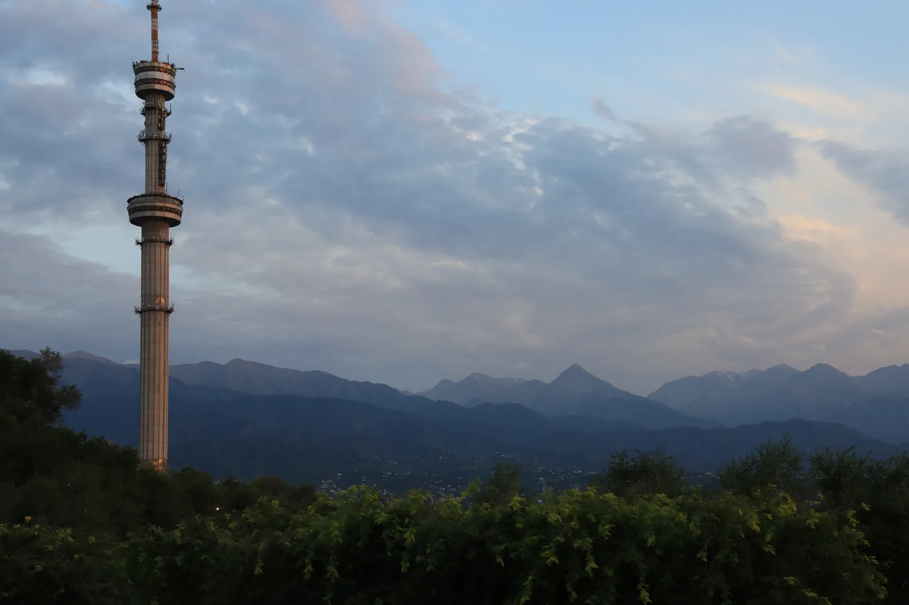

You can take a cable car from Abay Square, or climb up on foot along a relatively recently built pedestrian path.
Today's photos are from that path.
I specifically chose to come in the evening to catch the sunset, so a lot of the photos have the setting Sun in them.

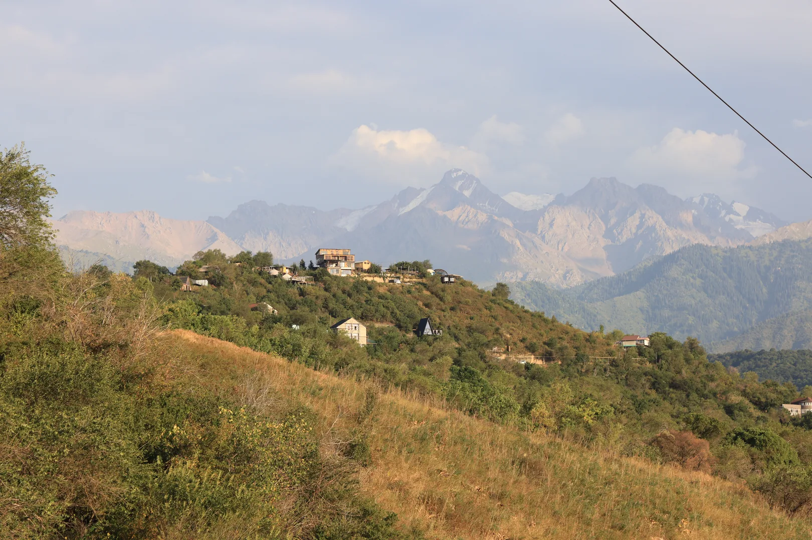
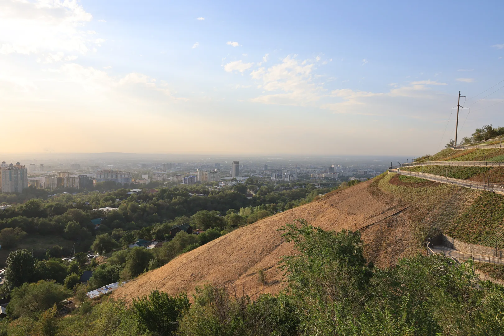
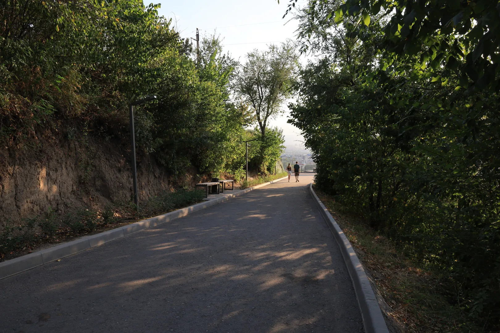
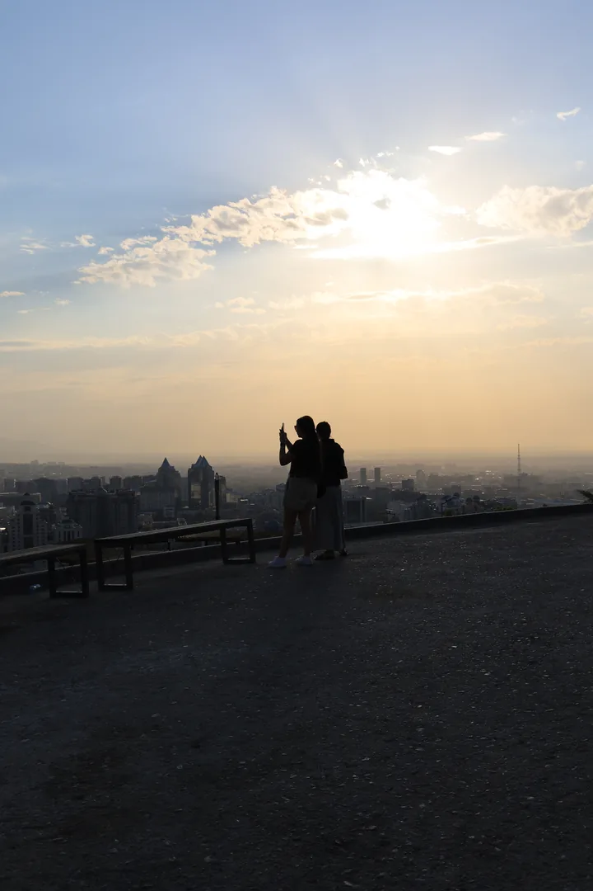
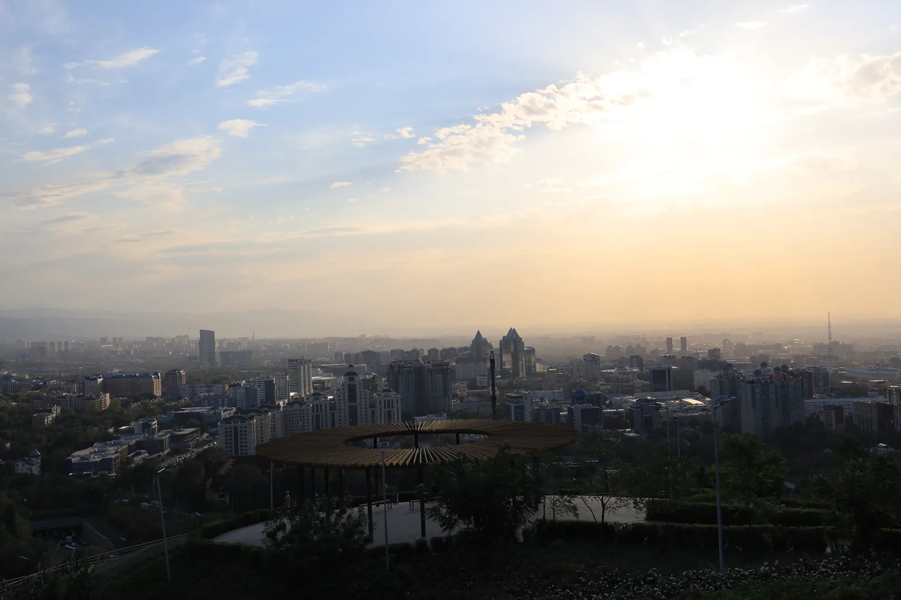
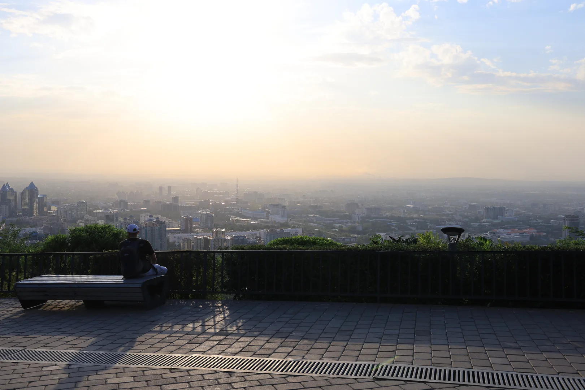

I overestimated the time needed to get to the top, so I waited for more than an hour to get sunset photos.

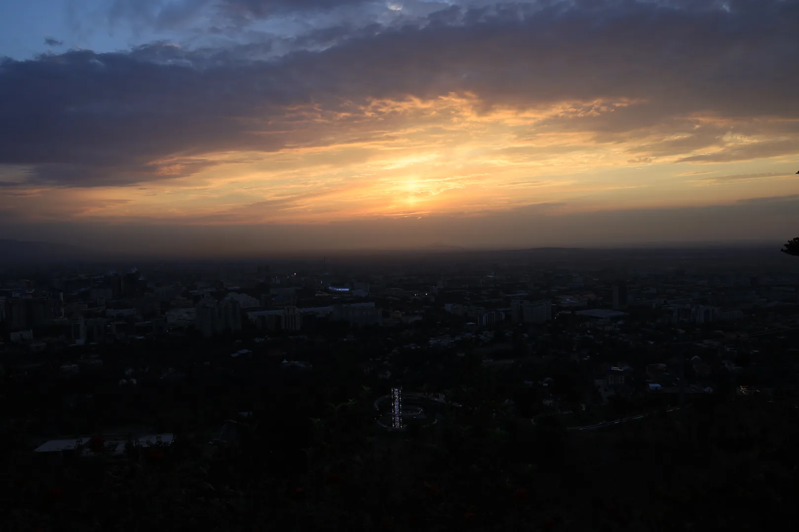
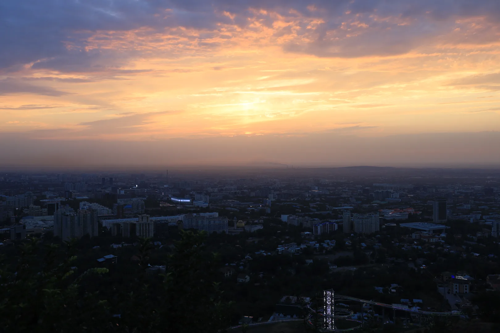
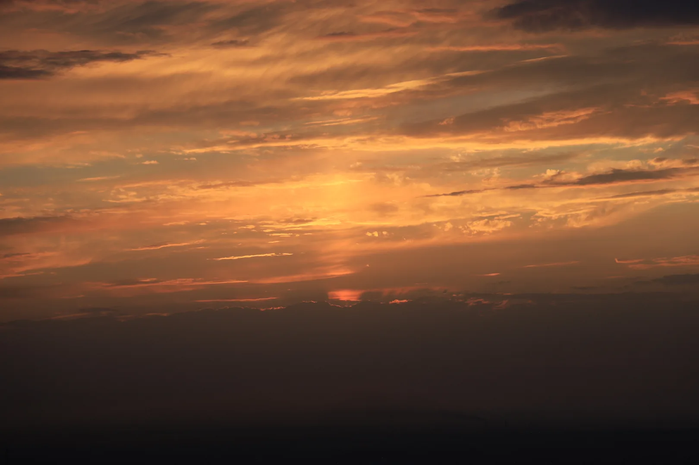
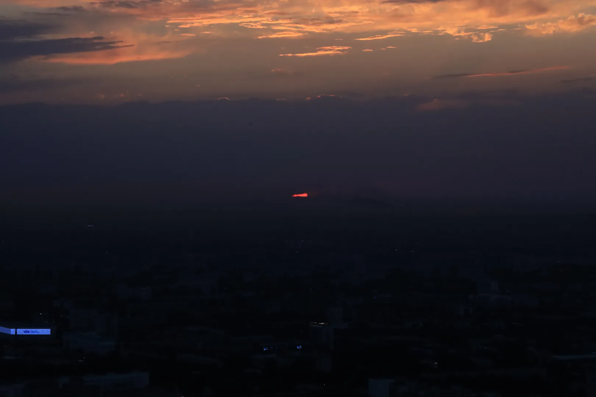
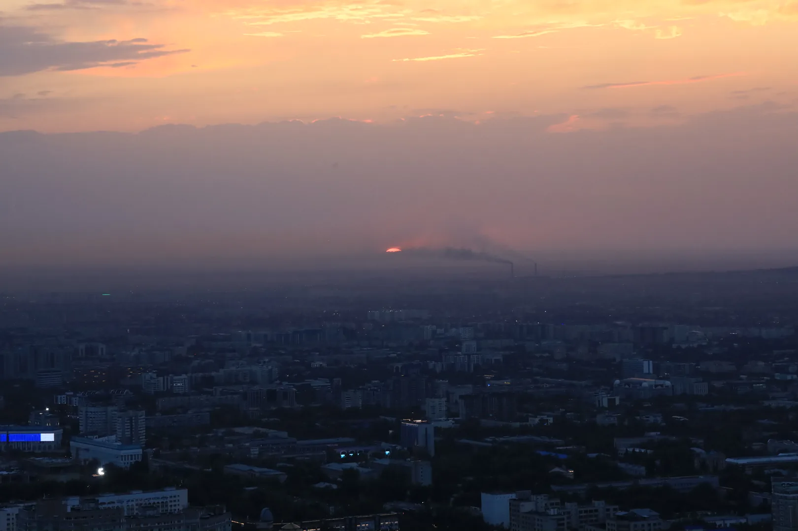

And views of the tower and Almaty after the sunset.

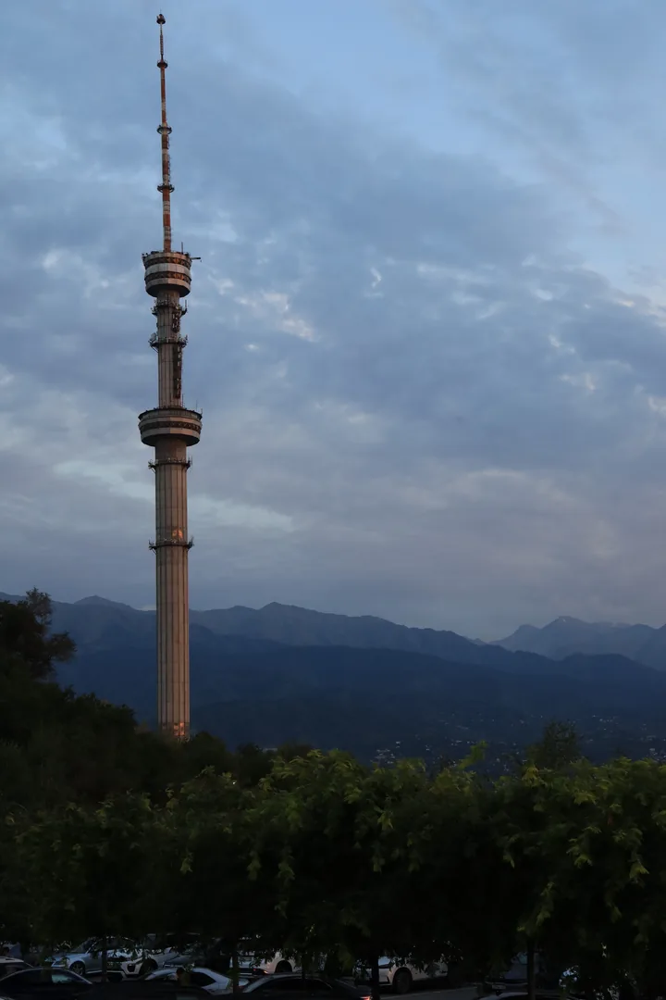
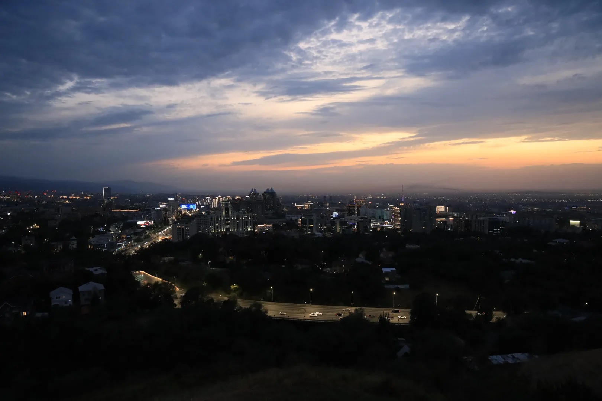
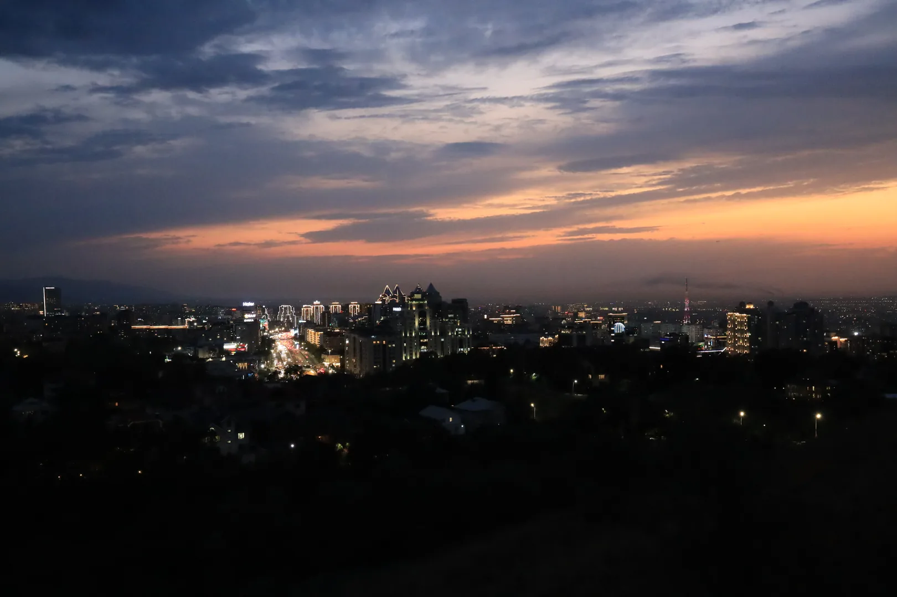

---

> This post is part of my [#100DaysToOffload](https://100daystooffload.com/) challenge.
