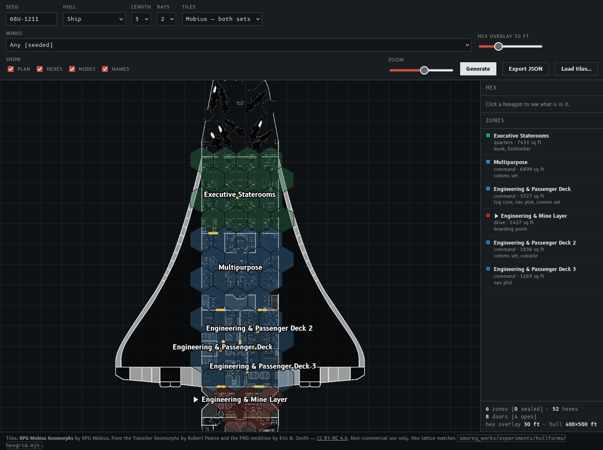

# Derelict Rogue. Day 1

This is the first post in what is somewhat a devlog series, about creating a submission to this year's [roguetemple's Fortnight](https://itch.io/jam/roguetemples-fortnight-2) game jam (or 14DRL, as it is otherwise known).

The task is to create a traditional roguelike game in two weeks.
The detailed restrictions are on the page, and I would say they are rather permissive.

If you look at the date of the post and the start of the jam, you can see that I didn't start on time.
The previous week was full of other worries, and all that went into the game was some thoughts and discussions with my co-author [Smoreg](https://itch.io/profile/smoreg).

We are still not completely sure what the game will be about, other than that it will involve exploring derelict spaceships as a drone (or a small party of drones).
But with the power of AI slop, we tested some of the design decisions, and Smoreg was able to complete a full run in his version.

I was mostly fascinated by a [ship generator](https://www.rolegenerator.com/en/module/spaceship) I found online, and by the fact that at least [some](https://www.rpgmobius.com/geomorphs) of the design tiles are free to use in non-commercial projects.
And I decided to explore what I could generate with those tiles, given some additional restrictions.

As you can see, it is a slow work in progress.
I am not sure which direction the game will develop in, but at least it is fun to explore concrete implementations instead of mind-bending game designs.

---

> This post is part of my [#100DaysToOffload](https://100daystooffload.com/) challenge.
