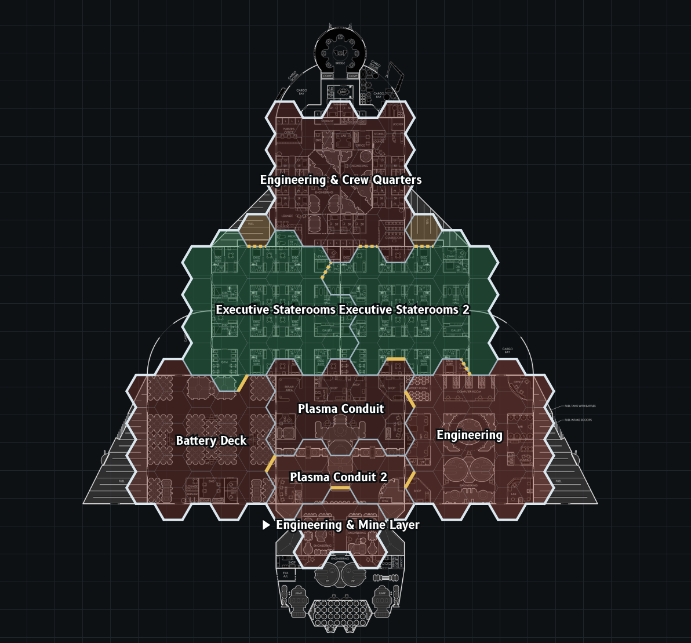

# Derelict Rogue. Day 2

Not much progress since the [previous](./2026-09-09-14drl-day1.md) day.
I've mostly played around with generator rules and wider ship designs: adding different shapes as prerequisites, adding rules for symmetry and corners, and deciding which tiles should be outer-only.

While I was discussing the game concept with [abbradar](https://abbradar.itch.io), he joked that my idea could be designed as a scenario for the strategy game [The Battle for Wesnoth](https://en.wikipedia.org/wiki/The_Battle_for_Wesnoth).
My initial ideas were drawn from another great game — [Invisible, Inc.](https://en.wikipedia.org/wiki/Invisible,_Inc.).
And those are very different kinds of gameplay: tactical strategy and turn-based stealth don't usually mix well.
But I decided to explore the idea of turning the game into a tactical roguelike with strategy elements, and proceeded to test on generated hexmaps with the simplest of mechanics for attacking, spawning, and controlling nodes.

After some testing, the idea of a tactical layer was intriguing enough that I think I will continue to improve it.
Adding a clock for derelict stability, similar to the alarm in Invisible, Inc.
And interactions with different ship systems to add to the tactical decisions and complexity.

---

> This post is part of my [#100DaysToOffload](https://100daystooffload.com/) challenge.
