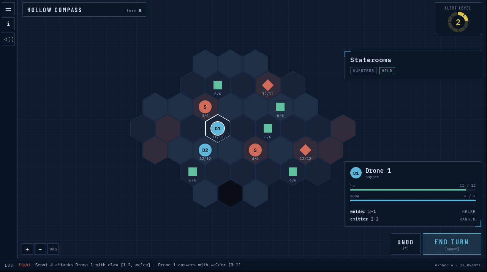
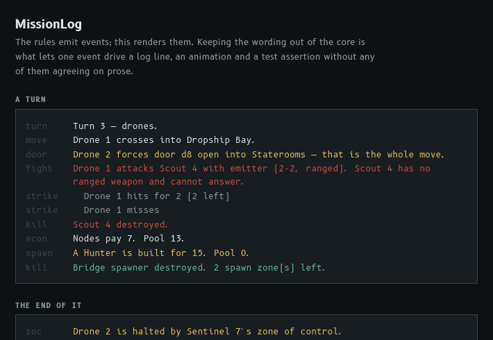

# Derelict Rogue. Day 3

In the [previous](./2026-09-10-14drl-day2.md) post I said I would continue to improve the tactical approach with more complexity.
But not today!
I decided it was not the time for more complexity before the game loop is in place and tested at least once with a vertical slice.
And also UI.
I always get frustrated quickly with the UI in my drafts, and with how much better things might look if only I spent enough time on them.

So today I spent most of the time drafting a vertical slice with only one mission type, only one predefined ship plan, and unchangeable drones and enemy behaviour.
In between getting frustrated at Claude's design decisions and at my inability to overcome my own laziness, I spent some time researching references (mostly Invisible, Inc. and The Battle for Wesnoth) and browsing free-to-use soundtracks.

Some UI screenshots, WIP.

Hopefully, over the weekend I will finish most of the vertical slice and the mechanics.
As we also need to merge ideas with [Smoreg](https://itch.io/profile/smoreg) at some point before polishing.

---

> This post is part of my [#100DaysToOffload](https://100daystooffload.com/) challenge.
