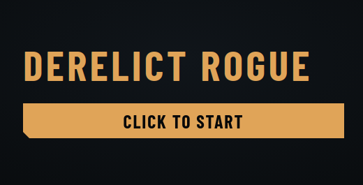
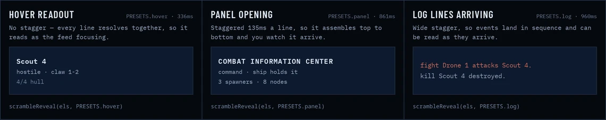
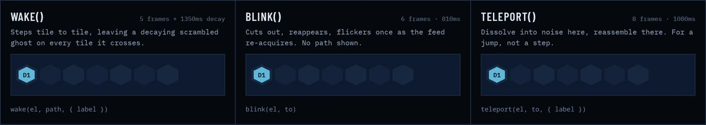
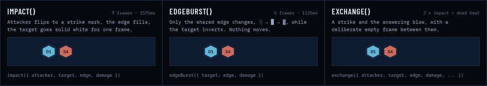
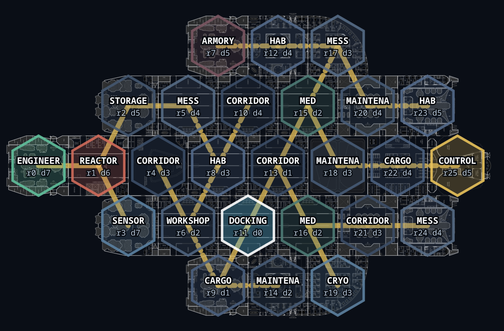
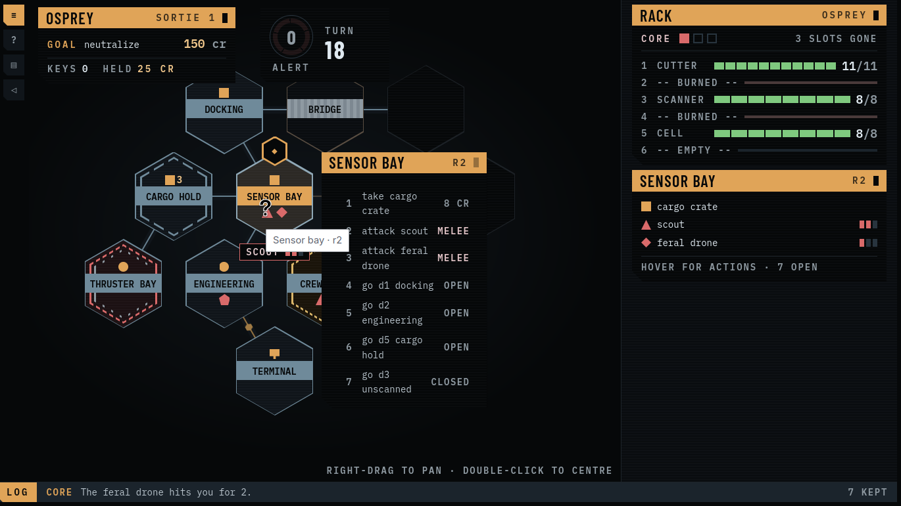

# Derelict Rogue. Final days

Days 4, 5, 6, and 7 all passed in a blur, with game development not being a top priority.
Thus, the final submission was not a complete success: a lot of bugs.
And most frustratingly, a lot of sloppy text by Claude Code.
I am not sure why it is that when you ask Claude models to generate a game tutorial, in-game lore, or anything to do with game UI, it starts overexplaining everything in such a confusing way that you are left with more questions than answers.

But let's lay out some stepping stones on how I got from the [previous](./2026-09-11-14drl-day3.md) post, with its ship generators and tactical battles with careful positioning, to a game with no positioning at all, where the ship looks less like a blueprint and more like a graph.

I spent most of the weekend on UI tweaks.
The elements were fine, but overall everything looked like a web application for data visualisation, and not a game.
While fooling around with different styles (asking Claude Design to surprise me was time not well spent), I grew more and more frustrated with the lack of animations.

So I decided to play around with generating different movement and attack animations, as well as panel and text appearances.
The main idea for the design was that, in the game's logic, what the player is looking at is some kind of display showing the information available at that moment.
So smooth animations felt out of place.

I already had similar thoughts with [Coherence](https://vuvko.itch.io/coherence-7drl), another roguelike for a game jam.
So I tried to reuse the text scrambling animation from there.

It looks good in these animations, but I needed some additional polish, because some wide symbols kept changing the size of elements on the page, and the animation timing needed to be adjusted so that large portions of text would appear quickly.

Next were the animations for drones on the field.
I needed at least one movement animation, and several attack animations for different weapons, to look convincing and convey a clear message to the player about what is going on.

And I had the great idea of leaving my agent optimising for some opaque metric, in the hope it would deliver a better ship generator and/or a better tactical system.
Did it pay off? Not in the slightest. I lost several hours trying to salvage what was done, when instead I should have just dropped its updates and reverted to what was working for me.

And with this, I lost confidence in my ability to finish a good tactical puzzle.
So Smoreg and I discussed how we would proceed, and decided to use his sloppy engine, refactor it to fit my UI ideas, and force it into something playable in 24 hours.
What could go wrong?

I started three parallel jobs:

* refactor the sloppy game engine to fit the UI needs,
* try to change the ship generator to fit the new game engine,
* think about how to restructure the monstrosity Claude Code created for the UI.

After the initial redesign, we merged the game and tried to play it in different ways.
Only to find more bugs, invisible options (that were forgotten in the new UI), phantom hotkey options (because the agent believed it had to create a true ASCII keyboard-only experience), and other vibecode hell.

With the finish line quickly approaching, I still felt I could finish with good-enough polish: replacing all the sloppy text, removing unnecessary mechanics, and adding a tutorial.
But a lot went wrong: mainly the code being a complete mess, and the agent spending an enormous amount of time trying to reproduce bugs, only to find out after hours of work that the node server it used was delivering the wrong modules.

I can understand why I was confident before the deadline.
In all my previous jams, I was crunching a lot of work into the final hours.
I finished a complete (but not great) tutorial and the starting dialogue for my submission to [Gamedev.js 2026](https://itch.io/jam/gamedevjs-2026/rate/4489036) in the final hour.
In [Office Hell](https://abbradar.itch.io/office-hell) we crunched almost an entire level in the final two hours.
So this time felt similar, and the task looked doable.
Only for me to discover new game mechanics while I was fixing UI bugs.

Overall, this game jam was a lot of frustration and fun.
Looking forward to the next adventure in designing a better roguelike!

And if you want to see and try this playable but messy game, here it is: [Derelict Rogue](https://vuvko.itch.io/derelict-rogue-14drl).

---

> This post is part of my [#100DaysToOffload](https://100daystooffload.com/) challenge.
