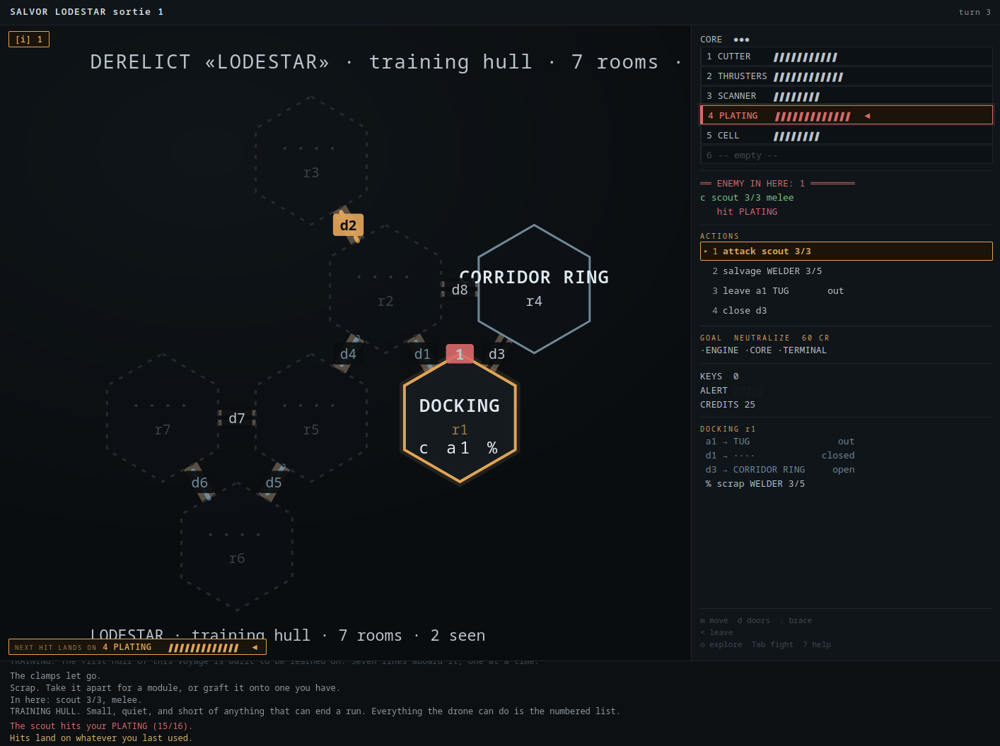
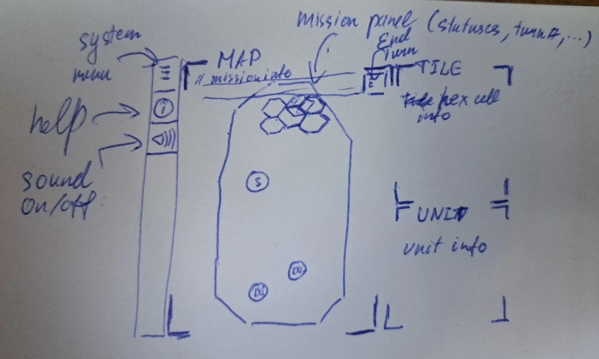
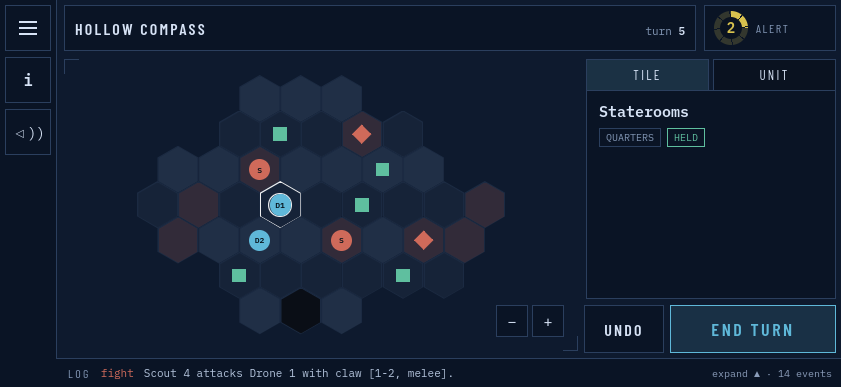
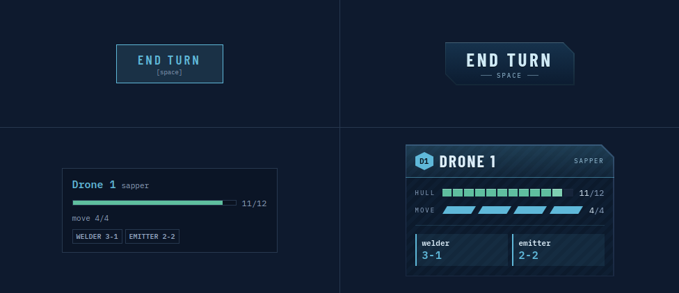
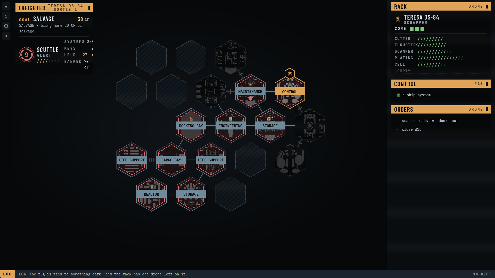

# Derelict Rogue. Thoughts and Postmortem

I thought about writing in this post about the many difficulties and lessons I learned while developing another small game for a game jam.
And the final submission was a buggy, sloppy mess, which generally means a lot of novel challenges.
But that was not what stopped me from completing the game in time.

Instead, I will tell a story that is partly a devlog recap, partly documentation of my tool usage and partly a compilation of interesting AI agent behaviours.

## Creation recap

### Pre-jam ideas

Even before the jam starts, you think about game ideas, mulling them over in your head, maybe trying to write them down.
One of my first ideas was a roguelike reimagining of a side-scrolling beat 'em up (think [Streets of Rage](https://en.wikipedia.org/wiki/Streets_of_Rage) or [Battletoads](https://en.wikipedia.org/wiki/Battletoads)), with the addition of a style system (similar to [Devil May Cry](https://en.wikipedia.org/wiki/Devil_May_Cry) or [Bayonetta](https://en.wikipedia.org/wiki/Bayonetta)).
That was also heavily influenced by [Shogun Showdown](https://en.wikipedia.org/wiki/Shogun_Showdown), which already has a similar energy implemented.
Another idea was about some turn-based simulation with the main character as an adventurer (think adventure mode for [Dwarf Fortress](https://en.wikipedia.org/wiki/Dwarf_Fortress)), but in a sci-fi setting.
That sci-fi setting was at some point merged into an idea for an extraction-based roguelike survival game, with [Duskers](https://en.wikipedia.org/wiki/Duskers) as the main inspiration.

Most of those ideas stopped at the phase where you only start writing down the facts you want from your game and a list of references to look at later.
Sometimes some AI chat is involved, to run a search for reference compilations, academic papers[^1], and the occasional prototype.
Most artefacts produced at this stage are unusable without proper research and review of the sources.
And prototypes are very limited by design, to try and test the smallest possible idea.

In my experience, if you chat with an AI agent in order to explore something new, or to generate something "surprising", it will fail at most of those tasks.
And even when you find something novel in the generation results, there will be a lot of decisions the agent made for you[^kreminski_dearth][^kreminski_similar].

### Start of the jam

At the start of the jam, [Smoreg](https://itch.io/profile/smoreg) and I only briefly described our ideas, our expectations, and how we would approach the jam.
We weren't of the same opinion about various things, and decided to build our own visions to test and illustrate our points.
If you've read my [day 1 devlog](./2026-09-09-14drl-day1.md), you know that we started implementing those visions only after a significant part of the jam had already passed.
Essentially, making it another 7DRL project.

I couldn't decide how the game would look until I played some of Smoreg's prototypes.
With a lot of confusing UI provided by Claude Code — which decided that everything should be ASCII-only and keyboard-only with no mouse support — I decided that I absolutely needed a more structural map generator.
This is also where my obsession with the recently-found [geomorph tiles](https://www.rpgmobius.com/geomorphs) became the main time-sink.

In both the [day 2](./2026-09-10-14drl-day2.md) and [day 3](./2026-09-11-14drl-day3.md) devlog posts you can see how much time I spent on creating a generator that would both use as many different tiles as possible and try to create a structurally plausible spaceship.
I used Claude Code for automating the tile taxonomy: adding tags based on the folder structure, the file name, and the text on the tile itself.
Also for trying different configurations under different structures and seeing what worked.
It went great for most of the tiles, but for some reason it really struggled with my ideas of combining different-sized tiles, or using corner tiles to smooth out transitions.

### The UI revamp

One of the issues was with the hexmap, and bringing it in line with my vision of adjacent-only combat similar to [The Battle for Wesnoth](https://en.wikipedia.org/wiki/The_Battle_for_Wesnoth).
After several rounds of using only Claude Code for UI, I switched to Claude Design to play around, as it is generally better for design iterations.
I sent it my screenshots of the hexmap, my hand-drawn draft, and a small list of instructions.
And after two iterations of overall element placement, I was rather satisfied with how it looked.

Only to then fail to see a game in my interface.
It all looked clean, but felt like some kind of web tool you use for work, not something you present as a fun experience for an evening.
This is where I lack expertise, so I decided to ask an AI assistant for broader research on the matter.
It pulled several references, but I'm not sure it followed them in anything other than fonts.
Because its UI suggestions felt like just more of the style decisions Claude makes every time you ask it to change the style without explicit direction.

### The final restructure

With the final day quickly approaching, I decided not to pursue my idea of what was basically a tactical RPG with roguelike elements.
And to use the engine developed by Smoreg, and transfer my UI vision on top of it.
That journey is described in full in my [devlog post](./2026-09-15-14drl-final-days.md), but as a recap: it was a good decision that needed to have been made much earlier in the development cycle.
And the most frustrating part was not the amount of lost work, but that the engine was built without any structural guidance for the AI agents.
And by the end, we had several different game revisions inside one repository and one branch.

We also stumbled on a problem where Smoreg's agent somehow decided to create another UI for the game, arguing that a lot of work had been cut by me (I removed the text translations, some of the game mechanics, and the option to choose an ASCII-only UI).
This led to several funny incidents where Smoreg sent me screenshots of bugs, and I told him he was playing the wrong version entirely.

Overall, the experience was once again fun and frustrating.
Fun to create new things, to try something and fail.
Frustrating to get through AI assistants failing to understand you, over-creating everything, and over-specifying what should be left undecided.

## What went wrong

Using code that was not regulated or structured.
The engine that was used had so much stuff implemented inside that it was a nightmare to remove it, or to fix the UI to handle the interactions correctly.
I had a similar experience before, but this time was much worse.

Chasing more ideas before implementing them.
That is essentially what always goes wrong in my projects.
I start to think about new mechanics, new visuals, or lore before finishing even the basic gameplay loop.

Not using AI bots to run full-game loops to find bugs.
I was so preoccupied with finishing UI touches that I forgot I should have a separate stable copy of the game being tested by autonomous bots.
They are great at spotting softlocks, critical bugs, and critical balance problems.
I eventually ran such an agent, but only after the submission.
In several hours it autonomously found and fixed several critical bugs that were soft-locking players.

## What went right

Collaboration.
Without collaborating with Smoreg, I don't think I would have completed the project even to the state in which it was published.

Using the sync options between Claude Code and Claude Design.
At first I was using those assistants separately.
But it was difficult to implement design changes on a codebase that knew nothing about the new design concepts.
Switching to that workflow made the whole process less frustrating.

---

> This post is part of my [#100DaysToOffload](https://100daystooffload.com/) challenge.

[^1]: Academic search engines are so unintuitive that I resort to Google Scholar for most of the reference research, but I found AI chats to be a good source of additional references. This is also how I [found](./2026-07-03-oatmeal-problem.md) the works of Max Kreminski.

[^kreminski_dearth]: Kreminski, Max. ["The dearth of the author in AI-supported writing."](https://dl.acm.org/doi/pdf/10.1145/3690712.3690725) Proceedings of the Third Workshop on Intelligent and Interactive Writing Assistants. 2024.

[^kreminski_similar]: Kreminski, Max. ["Endless forms most similar: the dearth of the author in AI-supported art."](https://link.springer.com/article/10.1007/s00146-025-02326-6) AI & SOCIETY 41.3 (2026): 1655-1669.
