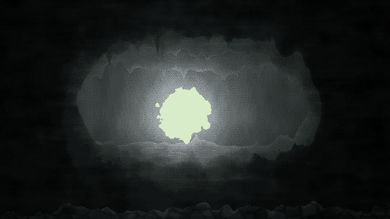
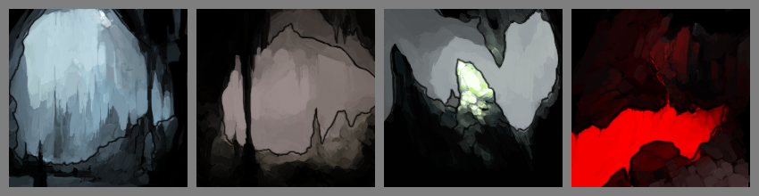
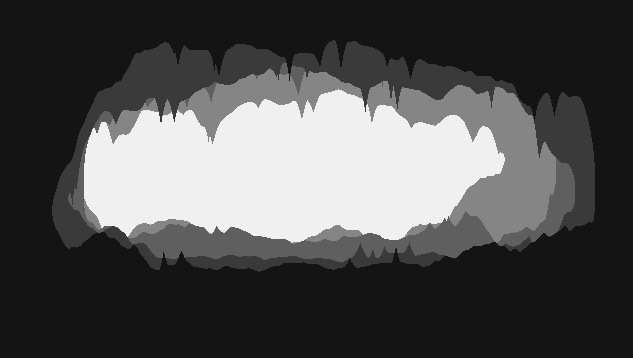
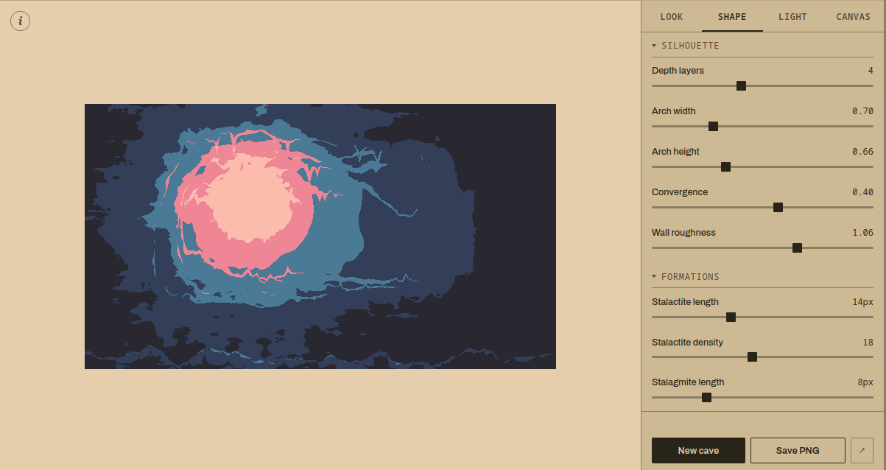

# Background Caves. No-AI Image Generator

While playing around with another game idea, I wanted to add a background image.
Something that would represent fantasy-looking underground caves.
I often procrastinate on making more impactful progress (say, creating a vertical slice with mechanics) by lurking around [itch.io](https://itch.io) or [OpenGameArt](https://opengameart.org).
As always, I found a lot of inspiring art ready to be used in almost any project.

One art piece by [Blarumyrran](https://opengameart.org/content/cave-picturesicons) looked almost like what I wanted.
But not quite.

I wanted a higher-res version and a landscape-oriented background.
First, I tried simple crops, squeezes, and mirroring.
All simple steps to try and match what you have with what you want.
But after that, I thought that what I wanted has a simple structure with some noise.
That should be perfect for procedural generation algorithms.

A quick search gave me some ideas, but not a tool I would be satisfied with[^2].
However, Claude knew some algorithms from memory, and produced an interesting demo of what I thought was basically what I needed.

I got interested in using that algorithm, based on noisy spectral synthesis[^perlin_synthesizer], and added several post-processing features I wanted: palette support, different illuminations, and pixelisation functions.

All of this looked more like a tool that could be used outside of my small project, and I know at least some tabletop enthusiasts are looking for procedural generators for their games.
This is why I decided to add some polish and publish it as a tool on itch: [Background Caves](https://vuvko.itch.io/background-caves).

---

> This post is part of my [#100DaysToOffload](https://100daystooffload.com/) challenge.

[^perlin_synthesizer]: Perlin, Ken. ["An image synthesizer."](https://dl.acm.org/doi/pdf/10.1145/325165.325247) ACM SIGGRAPH Computer Graphics 19.3 (1985): 287-296. As a side note, you can see some amazing demos in SIGGRAPH presentations — [here is an overview](https://www.youtube.com/watch?v=sIcGH3M5yPc) of some of the technical work presented this year.

[^2]: But there are some amazing repositories with texture generators I want to link. [This](https://github.com/tuxalin/procedural-tileable-shaders) is an old collection of different shaders that run generators based on different noise functions, as well as post-processing. [Another](https://github.com/ASTex-ICube/semiproctex) repository is about a specific method of generating textures.
